# E-Commerce App

## Description
The E-Commerce App is a mobile application built using Flutter that allows users to create an account, browse products, and manage their shopping experience seamlessly. Users can explore various categories and brands, view detailed product information, add items to their favorites and shopping cart, and edit their personal information.

## Features
1. User Registration and Profile: Users can create an account, manage personal information, and edit their profiles.
2. Product Browsing: Users can explore a wide range of products organized by categories and brands.
3. Product Details: Users can view detailed information about each product, including images, descriptions, prices, and specifications.
4. Favorites: Users can add products to their favorites for easy access later.
5. Shopping Cart: Users can add products to their cart, adjust quantities, and proceed to checkout.
6. Secure Checkout: Users can make secure payments through integrated payment gateways.

## Technologies Used
- Flutter
- Dart
- MVVM 
- Cubit (for state management)

## Screenshots
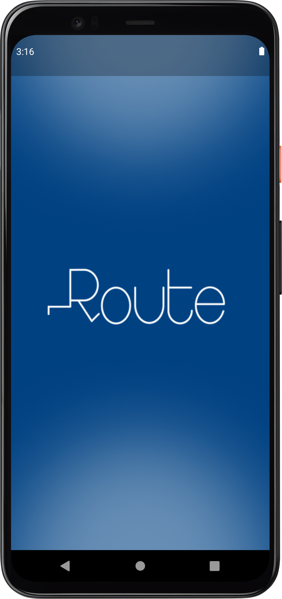  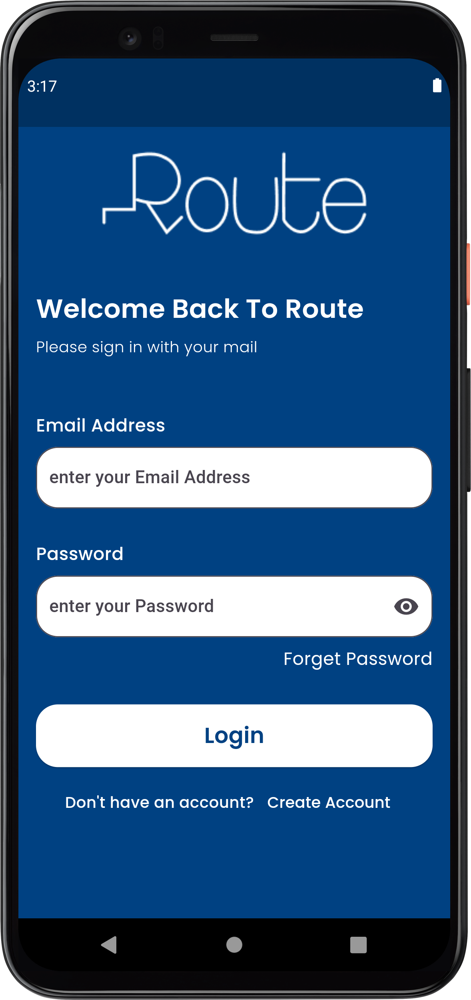  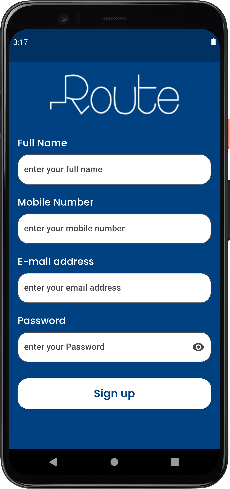  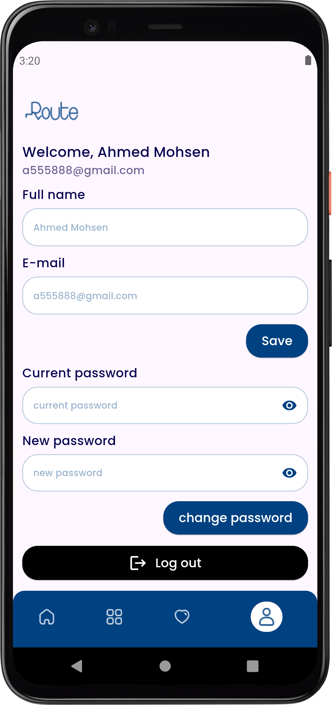  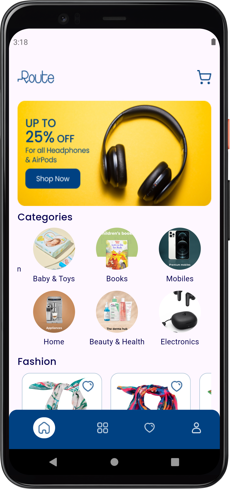 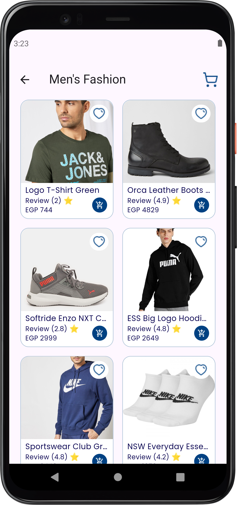 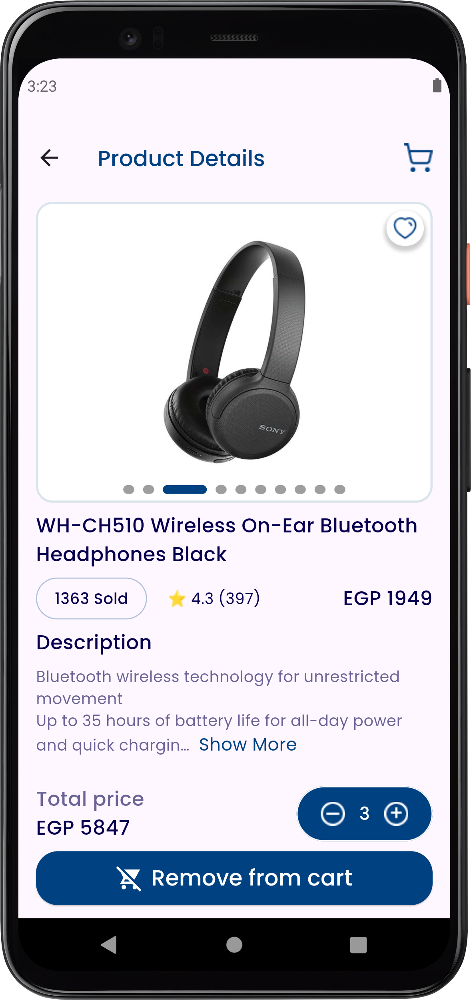 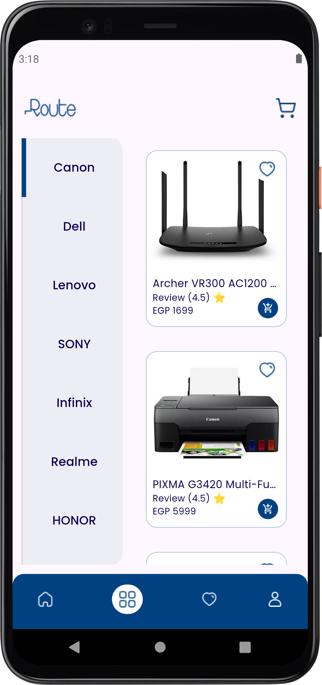  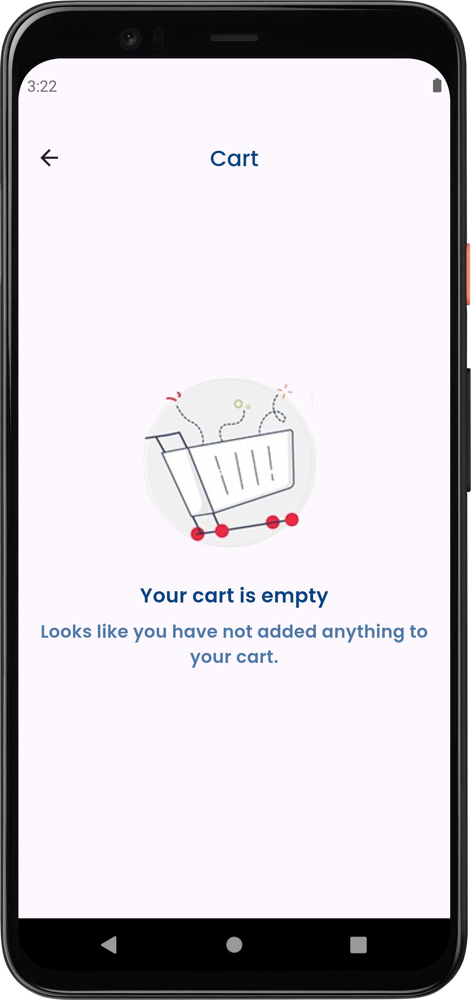 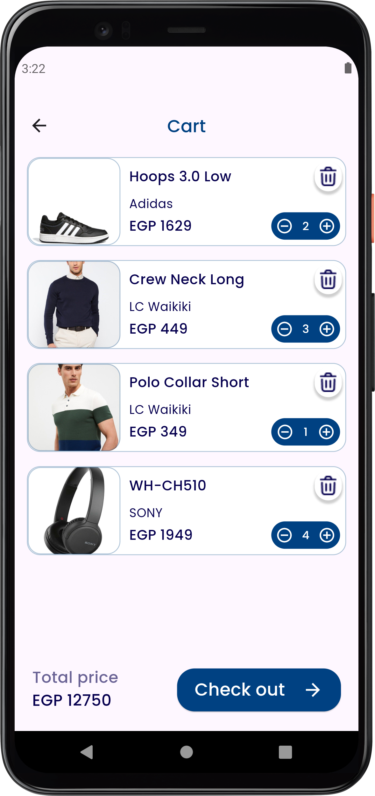 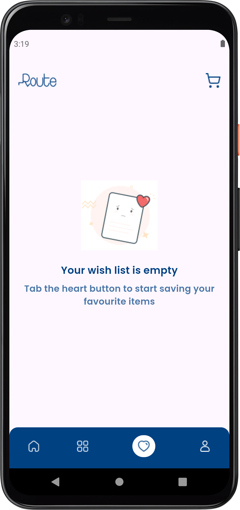  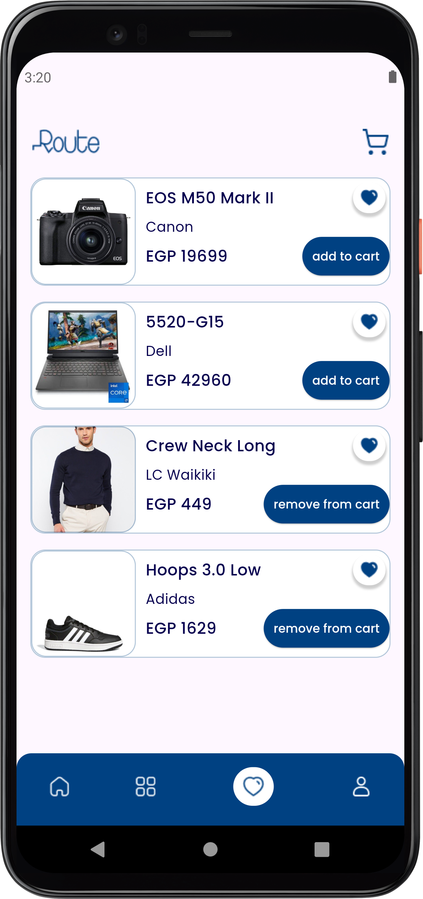 

## Contact
If you have any questions or feedback, please feel free to reach out to the project maintainers:
- Ahmed Mohsen : ahmedmohsen2492@gmail.com

